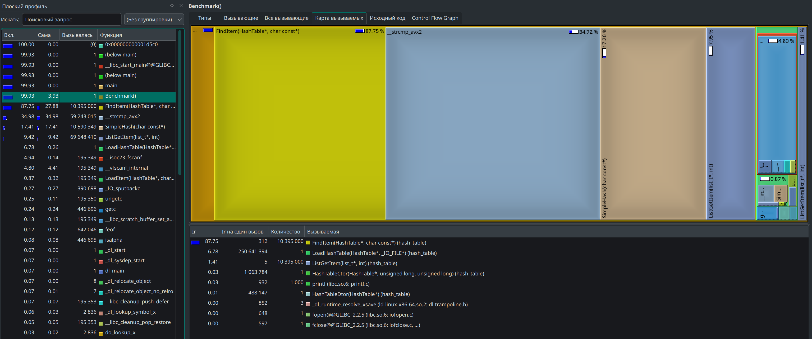
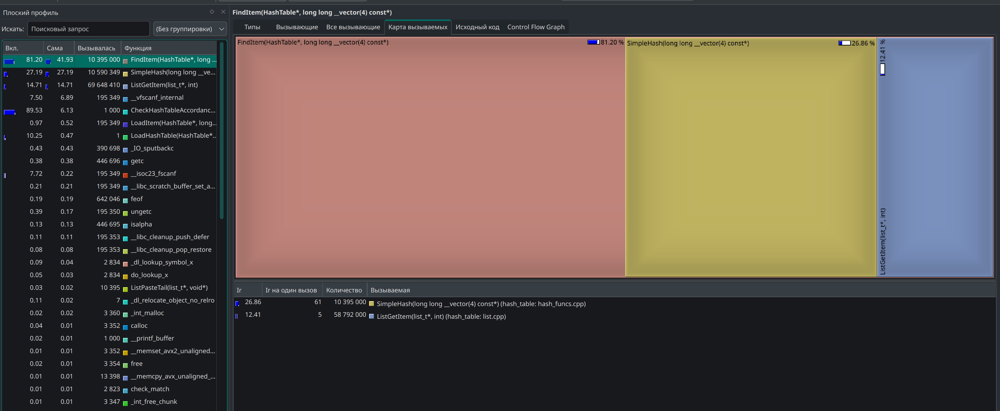

# Хеш-таблица
Шелонин Арсений, 1 курс ФРКТ МФТИ

## Описание проекта
Проект представляет собой базовую версию хеш-таблицы, элементами которой являются слова из текста. Программа загружает в хеш-таблицу данные из файла, а затем производит поиск определенных слов. Цель проекта - исследовать программу на быстродействие горячих функций и локальность с помощью профилировщиков и улучшить горячие функции тремя способами: ассемблерными вставками, интринсиками и отдельными ассемблерными функциями.

## Устройство хеш-таблицы
Наша хеш-таблица представляет из себя массив двусвязных списков (бакетов), каждый из которых содержит некоторое количество нод (далее будем называть это количество load-фактором). Нода представляет собой пару key (слово) - value (количество встреч).

<image src="readme_images/h_t_explanation.png" alt="хеш-таблица-пояснение" width=50%>

Структура хеш-таблицы
```C
struct BucketItem
{
    char  word[DEFAULT_WORD_LEN];
    size_t  val;     // how many times did the word occur
};

struct HashTable
{
    size_t  buckets_count;
    size_t  load_factor;
    list_t *buckets;
};
```

Итак, на вход хеш-таблице подаётся некоторое слово, затем некоторая хеш-функция сопоставляет этому слову хеш-код, по которому мы определяем соответствующий слову бакет. Таким образом, теперь нам надо искать слово не среди всех слов текста, а только среди слов данного бакета. В реальности load-фактор стараются делать около двух - в таком случае и список не нужен - но мы в учебных целях сделаем его около 10. 

На вход хеш-таблице подадим файл, состоящий из текста [Властелина Колец](https://www.cole13.com/wp-content/uploads/2023/08/Tolkien-J.-R.-R.-The-Fellowship-of-the-Ring-Tolkien-J.-R.-R.-Tolkien-J.-R.-R.-Z-Library.pdf) - это примерно двести тысяч слов.

### Про количество бакетов и load-фактор
Подберем количество бакетов так, чтобы load-фактор был около 10. 
Поставим некоторое количество бакетов `BUCKET_NUM`, загрузим хеш-таблицу и рассчитаем средний load-factor `load_factor_average` и среднеквадратическое отклонение $\sigma$

| BUCKET_NUM | load_factor_average | $\sigma$ |
|------------|---------------------|----------|
| 227        |  45.7               | 6.3      |
| 491        |  21.2               | 4.6      |
| 1117       |  9.3                | 3.1      |

### Про хеш-функцию

Итак, мы получили, что количество бакетов, равное 1117, оптимально для нашей задачи. Однако мы можем заметить, что среднеквадратическое отклонение довольно велико. Получившееся $\sigma = 3.1$ в последнем эксперименте говорит о том, что:

| отклонение | промежуток    | вероятность попадания в промежуток |
|------------|---------------|------------------------------------|
| $\sigma/2$ | $[7.8, 11.0]$ | $38\%$                             |
| $\sigma$   | $[6.3, 12.5]$ | $62\%$                             |
| $2\sigma$  | $[3.2, 15.6]$ | $95\%$                             |
| $3\sigma$  | $[0.1, 18.7]$ | $99.7\%$                           |

<image src="readme_images/3sigma.png" alt="Пример работы middle-end части" width=50%>

Это далеко от идеала, ведь, даже если мы сделаем начальный load-фактор равным 19, реаллоцировать придётся 0.3% бакетов - это около 3 реаллока, загружена будет где-то половина выделенной памяти, а разброс значений довольно велик.

В этом эксперименте я использовал самую обычную полиномиальную функцию `SimpleHash`:
<details>
<summary>SimpleHash</summary>

```C
SimpleHash(const char *const str)
{
    size_t hash = 5381;

    for (size_t i = 0; str[i] != '\0'; i++)
    {
        hash = hash * 33 + str[i];
    }

    return hash;
}
```

</details>

<br>

Она довольно проста и в целом имеет хорошее распределение, но попробуем найти функцию получше.

Используем известные `Murmurhash` и `XXH32`:

<details>
<summary>Murmurhash_32</summary>

```C
uint32_t Murmurhash_32(const char *const key)
{
    // fprintf(stderr, "mur");
    uint32_t str_len = strlen(key);

    uint32_t hash = 0;
    const uint32_t c1 = 0xcc9e2d51;
    const uint32_t c2 = 0x1b873593;
    const uint32_t r1 = 15;
    const uint32_t r2 = 13;
    const uint32_t m = 5;
    const uint32_t n = 0xe6546b64;

    const uint8_t *data = (const uint8_t *)key;
    const int nblocks = str_len / 4;

    // Обработка блоков по 4 байта
    for (int i = 0; i < nblocks; i++) {
        uint32_t k;
        memcpy(&k, data + i * 4, sizeof(k));

        k *= c1;
        k = (k << r1) | (k >> (32 - r1));
        k *= c2;

        hash ^= k;
        hash = (hash << r2) | (hash >> (32 - r2));
        hash = hash * m + n;
    }

    // Обработка оставшихся байтов
    const uint8_t *tail = data + nblocks * 4;
    uint32_t k1 = 0;

    switch (str_len & 3)
    {
        case 3: k1 ^= tail[2] << 16; [[fallthrough]];
        case 2: k1 ^= tail[1] << 8;  [[fallthrough]];
        case 1: k1 ^= tail[0];
                k1 *= c1;
                k1 = (k1 << r1) | (k1 >> (32 - r1));
                k1 *= c2;
                hash ^= k1;
    }

    // Финальное перемешивание
    hash ^= str_len;
    hash ^= hash >> 16;
    hash *= 0x85ebca6b;
    hash ^= hash >> 13;
    hash *= 0xc2b2ae35;
    hash ^= hash >> 16;

    return hash;
}
```
</details>

<details>
<summary>XXH32</summary>

```C

static uint32_t XXH_read32(const void* ptr) 
{
    uint32_t val;
    memcpy(&val, ptr, sizeof(val));
    return val;
}

// Основная функция xxHash32
uint32_t XXH32(const char *const input_str) 
{
    size_t   len = strlen(input_str);
    uint32_t seed = 0;

    const uint8_t* data = (const uint8_t*)input_str;
    const uint8_t* end = data + len;
    uint32_t h32;

    if (len >= 16) {
        const uint8_t* limit = end - 16;
        uint32_t v1 = seed + XXH_PRIME32_1 + XXH_PRIME32_2;
        uint32_t v2 = seed + XXH_PRIME32_2;
        uint32_t v3 = seed + 0;
        uint32_t v4 = seed - XXH_PRIME32_1;

        // Обработка блоков по 16 байт
        do {
            v1 += XXH_read32(data) * XXH_PRIME32_2;
            v1 = (v1 << 13) | (v1 >> 19);
            v1 *= XXH_PRIME32_1;
            data += 4;

            v2 += XXH_read32(data) * XXH_PRIME32_2;
            v2 = (v2 << 13) | (v2 >> 19);
            v2 *= XXH_PRIME32_1;
            data += 4;

            v3 += XXH_read32(data) * XXH_PRIME32_2;
            v3 = (v3 << 13) | (v3 >> 19);
            v3 *= XXH_PRIME32_1;
            data += 4;

            v4 += XXH_read32(data) * XXH_PRIME32_2;
            v4 = (v4 << 13) | (v4 >> 19);
            v4 *= XXH_PRIME32_1;
            data += 4;
        } while (data <= limit);

        h32 = (v1 << 1) | (v1 >> 31);
        h32 += (v2 << 7) | (v2 >> 25);
        h32 += (v3 << 12) | (v3 >> 20);
        h32 += (v4 << 18) | (v4 >> 14);
    } 

    else 
    {
        h32 = seed + XXH_PRIME32_5;
    }

    // Добавляем оставшиеся байты
    h32 += (uint32_t)len;

    // Финальное перемешивание
    while (data + 4 <= end)
    {
        h32 += XXH_read32(data) * XXH_PRIME32_3;
        h32 = ((h32 << 17) | (h32 >> 15)) * XXH_PRIME32_4;
        data += 4;
    }

    while (data < end)
    {
        h32 += (*data) * XXH_PRIME32_5;
        h32 = ((h32 << 11) | (h32 >> 21)) * XXH_PRIME32_1;
        data++;
    }

    // Avalanche effect (улучшение распределения)
    h32 ^= h32 >> 15;
    h32 *= XXH_PRIME32_2;
    h32 ^= h32 >> 13;
    h32 *= XXH_PRIME32_3;
    h32 ^= h32 >> 16;

    return h32;
}

```

</details>

<br>

Для них получаем такой результат:

|      хеш-функция  |  $\sigma$        |
|-------------------|------------------|
| Murmurhash        |  3.077           |
| XXH32             |  3.045           |
| SimpleHash        |  3.092           |

Интересно, что значения $\sigma$ почти не отличаются. Тогда смысл переходить на какую-то более сложную другую функцию отпадает и мы будем использовать `SimpleHash`. Начальный load-фактор зададим как load_factor_average + $3\sigma  \approx 19$. Тогда в теории на $1117$ бакетов должно вызваться около $0.3\% * 1009 = 3$ реаллока. Проверим теорию практикой - создадим статическую переменную в функции реаллокации списка и посчитаем количество её вызовов. Запустив программу получим $2$ вызова - очень близко с теорией. 


## Параметры системы

### Эталонная машина
* Процессор - Intel Core Ultra 5 125H
* Частота процессора при измерениях - 2000MHz
* OC - Manjaro Linux

#### Про запуск программы
Для корректных и точных расчётов количества тактов, затраченных на работу программы, выполним два действия:
* Установим стационарную частоту процессора по ядрам:
```bash
$ sudo cpupower frequency-set -u 2000MHz    # верхняя граница
$ sudo cpupower frequency-set -d 2000MHz    #  нижняя граница
```

* Установим наивысший приоритет нашей программе, используя утилиту `nice` с флагами `-n -20`. Запускать программу будем так:


Программа запускалась и тестировалась следующими программами:

| Программа       |  Версия         |
|-----------------|-----------------|
| gcc             | 14.2.1          |
| valgrind        | 3.24.0          |
| perf            | 6.14-1          |
| cpupower        | 6.14-1          |
| nice            | 9.6             |


## Ход работы

Для начала клонируйте репозиторий:
```bash
$ git clone https://github.com/71frukt/HASH_TABLE.git
```

Соберите проект:
```bash
$ make
```

* `make run` - запуск программы  
* `make rebuild` - пересобрать  
* `make clean` - очистить
* `make gdb` - запуск под gdb
* `make callgrind` - запуск под valgrind

Аргументы make:

### Метод анализа производительности программы в тактах процессора

Итак, запустим начальную версию программы. Для анализа числа тактов я написал скрипт на python, который делает 10 запусков программы под perf и считает среднее значение и погрешность. В программе загружается хеш-таблица, а затем прогоняется поиск каждого элемента в цикле из 1000 итераций. Для того, чтобы гарантированно функция вызвалась и полностью выполнилась 1000 раз, цикл нужно защитить от оптимизаций компилятора. Про особенности защиты от оптимизатора можно прочитать [здесь](https://github.com/71frukt/FRACTAL). 

<details>
<summary>Цикл поиска</summary>

```C
volatile HashTableVerifyCode code = HASH_TABLE_OK;
HashTableVerifyCode (*volatile wrapper)(HashTable *hash_table) = CheckHashTableAccordance;

for (size_t i = 0; i < 1000; i++)
{
    printf("i = %d\n", i);
    code = wrapper(&hash_table);
}
```
</details>

<br>

`CheckHashTableAccordance(&hash_table)` берет элемент, "забывает" его и ищет, сверяя, нашёл тот же самый элемент, что выбрал, или другой. 

<details>
<summary>CheckHashTableAccordance</summary>

```C
HashTableVerifyCode CheckHashTableAccordance(HashTable *hash_table)
{
    for (size_t bucket_num = 0; bucket_num < hash_table->buckets_count; bucket_num++)
    {
        list_t *cur_bucket = hash_table->buckets + bucket_num;
        int item_index = cur_bucket->head;

        if (cur_bucket->tail == cur_bucket->head)    // free bucket
            continue;

        while (true)
        {
            BucketItem *cur_item   = (BucketItem*) ListGetItem(cur_bucket, item_index);
            char *cur_word         = cur_item->word;
            
            BucketItem *found_item = (BucketItem*) FindItem(hash_table, cur_word);
            
            if (cur_item != found_item)
            {
                log(WARNING, "incorrectly find word: item_index = %d, bucket = %d, word = %s", item_index, cur_bucket, cur_word);
                return HASH_TABLE_ACCORDANCE_ERR;
            }

            if (item_index == cur_bucket->tail)
                break;
                
            item_index = cur_bucket->next[item_index];
        }
    }

    return HASH_TABLE_OK;
}
```
</details>

<br>

Запуск скрипта:
```bash
$ python benchmark/perf_profile_all_cores.py
```

Результат:

| Запуск   | Общее количество тактов | Тактов E-cores         | Тактов P-cores        |
|--------|------------------------:|-------------------:|-------------------:|
| 1      |  3 060 360 901          | 1 239 238 678      | 1 821 122 223      |
| 2      |  3 517 551 614          | 1 699 746 136      | 1 817 805 478      |
| 3      |  3 564 688 928          | 1 730 447 025      | 1 834 241 903      |
| 4      |  3 461 881 227          | 1 639 343 742      | 1 822 537 485      |
| 5      |  3 418 311 154          | 1 600 057 991      | 1 818 253 163      |
| 6      |  3 634 122 817          | 1 812 363 864      | 1 821 758 953      |
| 7      |  3 520 786 419          | 1 681 085 282      | 1 839 701 137      |
| 8      |  3 589 734 732          | 1 769 501 560      | 1 820 233 172      |
| 9      |  3 495 835 740          | 1 662 103 432      | 1 833 732 308      |
| 10     |  3 634 521 147          | 1 784 699 058      | 1 849 822 089      |

* Среднее значение - 1 831 603 707
* Вариация - 0,005

Это никуда не годится, тем более трудно сказать, как процессор работает с энергоэффективными ядрами и как рассчитывать общее количество тактов. Можно заметить, что значение на энергоэффективных ядрах постоянно скачет, в то время как значение производительных остаётся почти неизменным. Тогда запустим программу исключительно на производительных ядрах. Для этого при запуске используем утилиту `taskset -c 0-7` - на моем процессоре это производительные ядра. 

Запуск второго скрипта (работа программы на производительных ядрах):
```bash
$ python benchmark/perf_profile_p_cores.py
```

| Запуск | Тактов P-cores     |
|--------|-------------------:|
| 1      | 1 826 787 794      |
| 2      | 1 900 291 050      |
| 3      | 1 828 828 847      |
| 4      | 1 817 112 332      |
| 5      | 1 833 446 104      |
| 6      | 1 833 411 733      |
| 7      | 1 815 327 571      |
| 8      | 1 807 808 776      |
| 9      | 1 826 684 621      |
| 10     | 1 826 338 238      |

* Среднее значение - **1 824 521 652**
* Вариация - **0,002**

Эти результаты имеют высокое качество.

## Анализ горячих функций
Для анализа отдельных частей программы, используем профилирощик valgrind:
```bash
$ make callgrind
$ kcachegrind callgrind.out.*
```



Видим, что наибольшее собственное время работы имеет strcmp, которая вызывается по несколько раз при поиске каждого элемента - её нужно оптимизировать в первую очередь.

### Оптимизация `strcmp`
Все слова текста точно меньше 32 букв, тогда мы можем класть слова в YMM-регистры. Изменим структуру элемента бакета:

```C
struct BucketItem
{
    // char  word[DEFAULT_WORD_LEN];
    __m256i word;     // < 32 letters
    size_t  val;      // how many times did the word occur
};
```

Считывать слова будем так:

_часть цикла функции `LoadHashTable()`_
```C
char cur_word[DEFAULT_WORD_LEN] = {};   // DEFAULT_WORD_LEN = 32
fscanf(source, "%" STR(DEFAULT_WORD_LEN) "[a-zA-Z]", cur_word);
// after preprocessor  fscanf(source, "%32[a-zA-Z]", cur_word);
__m256i cur_word_m256 = _mm256_loadu_si256((__m256i *)cur_word);  
````

// НАПИСАТЬ ПРО ТО КАК РЕАЛИЗОВАЛ 

Измерив производительность этой версии программы, получим:

| Запуск | Тактов P-cores    |
|--------|------------------:|
| 1      | 1 237 381 069     |
| 2      | 1 234 649 431     |
| 3      | 1 245 342 226     |
| 4      | 1 247 932 067     |
| 5      | 1 243 508 794     |
| 6      | 1 246 913 719     |
| 7      | 1 227 623 024     |
| 8      | 1 246 940 879     |
| 9      | 1 248 361 049     |
| 10     | 1 239 527 311     |

* Среднее значение - **1 241 817 957**
* Вариация - **0,005**

Это на **32%** быстрее, чем прошлая версия.  
Снова проведем анализ профилировщиком valgrind. Имеем:



Видим, что функция `strcmp` действительно ушла из списка горячих функций (действительно, ведь мы только что вырезали их всех из программы). Теперь на первом месте, собственно, сама функция поиска, а на втором наша простая хеш-функция. 